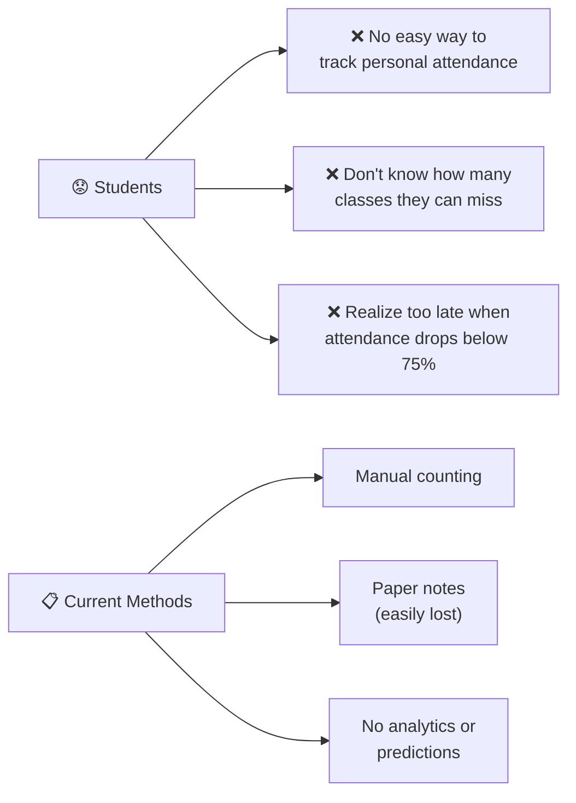
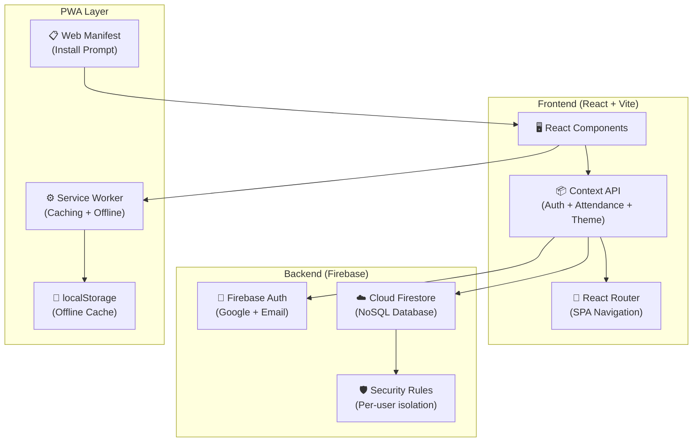
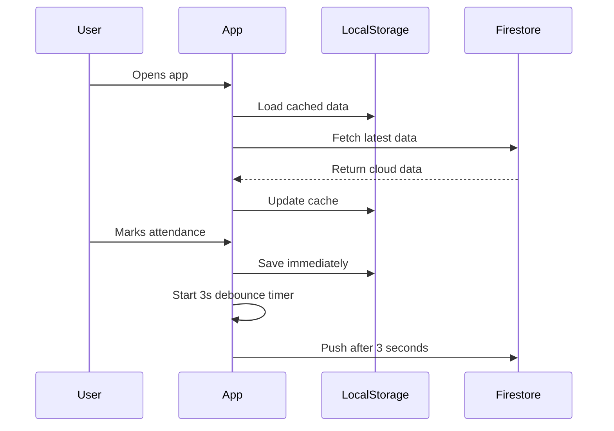
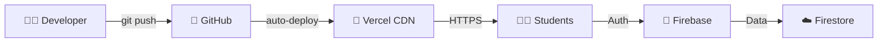

# 🎓 MANIT Smart Attendance Tracking System
## Internship Project Presentation

**Maulana Azad National Institute of Technology, Bhopal**

---

> [!IMPORTANT]
> **Replace `[Your Name]`, `[Your Scholar No]`, `[Your Branch]`, and `[Mentor Name]` with your actual details before presenting.**

---

## Slide 1 — Title Page

| | |
|---|---|
| **Project Title** | MANIT Smart Attendance Tracking System |
| **Institution** | Maulana Azad National Institute of Technology, Bhopal |
| **Student Name** | [Your Name] |
| **Scholar Number** | [Your Scholar No] |
| **Branch / Year / Semester** | [Your Branch] / 3rd Year / 5th Semester |
| **Mentor / Guide** | [Mentor Name] |
| **Technology** | React.js, Firebase, Progressive Web App (PWA) |
| **Type** | Web Application + Installable Mobile App |

---

## Slide 2 — Problem Statement

### The Problem: Attendance Tracking at MANIT



**Key Issues:**
- Students have **no real-time visibility** into their attendance percentage
- **75% minimum attendance** is mandatory but hard to track manually
- No way to predict **"Can I miss tomorrow's class?"**
- Existing solutions are either **too complex** or **not MANIT-specific**
- Data is lost when phone changes or paper gets misplaced

---

## Slide 3 — Proposed Solution

### MANIT Smart Attendance — A Complete Solution

A **Progressive Web Application** that lets students:

| Capability | How it Helps |
|------------|-------------|
| ✅ **Track attendance daily** | One-tap mark as Present/Absent/Holiday |
| 📊 **See analytics instantly** | Charts, trends, and subject-wise breakdown |
| 🧮 **Predict safe bunks** | "Can miss X more classes" — calculated per subject |
| ☁️ **Cloud sync** | Data backed up via Firebase — access from any device |
| 📱 **Install as app** | PWA installable on mobile — works like native app |
| 🔐 **Secure login** | Google Sign-In — no password to remember |
| 💾 **Offline support** | Works without internet, syncs when back online |

---

## Slide 4 — System Architecture



---

## Slide 5 — Technology Stack

| Layer | Technology | Why Chosen |
|-------|-----------|------------|
| **Frontend** | React 18 | Component-based, huge ecosystem, industry standard |
| **Build Tool** | Vite 5 | 10x faster than Webpack, instant hot reload |
| **Authentication** | Firebase Auth | Google Sign-In with zero backend setup |
| **Database** | Cloud Firestore | Real-time sync, auto-scaling, free tier |
| **Animations** | Framer Motion | Spring physics, gesture support, layout animations |
| **Charts** | Recharts | React-native chart library, responsive |
| **Icons** | Lucide React | 1000+ modern SVG icons |
| **Styling** | CSS Variables | Custom design system, theme-able, no framework lock-in |
| **PWA** | Service Worker + Manifest | Installable, offline-capable, push-ready |
| **Hosting** | Vercel | Auto-deploy from Git, free SSL, global CDN |

---

## Slide 6 — Features Deep Dive

### 6.1 Dashboard
- Overall attendance percentage with color-coded status
- Today's class list with quick-mark links
- Weekly attendance trend chart (area chart)
- Subject-wise breakdown with "can miss X more" info
- Quick action cards to navigate features

### 6.2 Attendance Marking
- One-tap **Present / Absent / Holiday** buttons
- Animated feedback with confetti on attendance marks
- **Undo** button to correct mistakes
- 🎉 Celebration banner when all classes are marked
- Per-subject period count awareness

### 6.3 Subject Management
- Add/Edit/Delete subjects with full details
- Per-day period configuration (e.g., Monday: 2 periods, Thursday: 1)
- **10 color themes** for visual distinction
- Subject-specific attendance calendar with click-to-toggle
- Teacher name tracking

### 6.4 Smart Analytics
- What-if calculator: "If I miss 5 classes, what will my attendance be?"
- Attendance trend over last 7 days
- Subject comparison charts
- Exportable CSV reports
- Monthly calendar view with attendance markers

### 6.5 Cloud & Security
- **Google Sign-In** — no password to remember
- **Firestore** — auto-sync across devices
- **Per-user data isolation** — students can only see their own data
- **Offline mode** — continues working without internet
- **JSON backup** — manual export/import for additional safety

---

## Slide 7 — Design Highlights

### Premium UI/UX Design

| Design Element | Implementation |
|---------------|---------------|
| **Glassmorphism** | `backdrop-filter: blur(16px)` with semi-transparent cards |
| **Dark/Light Mode** | CSS variables swap via `data-theme` attribute |
| **12 Color Themes** | HSL-generated palettes with live preview |
| **Micro-animations** | 12+ CSS keyframes (shimmer, slide, pop, glow, confetti) |
| **Spring Physics** | Framer Motion with `stiffness: 300, damping: 25` |
| **Custom Font** | Outfit (Google Fonts) — modern, geometric |
| **Responsive** | Works on desktop (sidebar) + mobile (hamburger menu) |
| **Interactive Background** | Canvas-based particle system with mouse tracking |

---

## Slide 8 — Database Design

### Firestore Document Structure

```
users/
  └── {userId}/                    ← One document per student
        ├── subjects: [            ← Array of subject objects
        │     {
        │       id: "sub1",
        │       name: "Data Structures",
        │       code: "CS301",
        │       teacher: "Dr. Kumar",
        │       days: ["Monday", "Wednesday"],
        │       periodsPerDay: { Monday: 1, Wednesday: 2 },
        │       totalClasses: 40,
        │       attended: 32,
        │       color: "#3b82f6"
        │     }
        │   ]
        ├── profile: {
        │     name, scholarNo, branch,
        │     section, year, semester
        │   }
        ├── history: {             ← Date-indexed attendance records
        │     "2026-05-30": {
        │       "sub1": "present",
        │       "sub2": "absent"
        │     }
        │   }
        ├── schedule: {            ← Weekly timetable
        │     Monday: ["sub1", "sub5"],
        │     Tuesday: ["sub3", "sub4"]
        │   }
        └── updatedAt: "2026-05-30T..."
```

### Security Rules
```javascript
match /users/{userId} {
  allow read, write: if request.auth != null
                     && request.auth.uid == userId;
}
```
Each student can **only** read/write their own document.

---

## Slide 9 — Key Algorithms

### 9.1 Classes Can Miss (Safe Bunk Calculator)

```
canMiss = attended - ⌈(totalClasses × 75) / 100⌉
```

If `canMiss > 0` → Student can safely skip that many classes.

### 9.2 Classes Needed to Reach 75%

```
needed = ⌈(75 × total - 100 × attended) / (100 - 75)⌉
```

### 9.3 Cloud Sync Strategy



---

## Slide 10 — Deployment & Distribution

| Channel | Method | URL/Access |
|---------|--------|-----------|
| 🌐 **Website** | Vercel (auto-deploy from GitHub) | `https://manit-attendance.vercel.app` |
| 📱 **Android App** | PWA Install / PWABuilder APK | Install button in header |
| 🍎 **iOS App** | Safari "Add to Home Screen" | Works as home screen app |
| 💻 **Desktop App** | Chrome/Edge "Install" | Runs in standalone window |
| 📦 **APK File** | Generated via PWABuilder.com | Shareable via Drive/WhatsApp |

### Deployment Architecture



---

## Slide 11 — Security Measures

| Threat | Protection |
|--------|-----------|
| Unauthorized data access | Firestore rules enforce `auth.uid == userId` |
| Password theft | Google OAuth — no passwords stored |
| Data loss | Auto cloud sync + manual JSON backup |
| MITM attacks | HTTPS enforced via Vercel |
| XSS attacks | React auto-escapes user input |
| Session hijacking | Firebase Auth manages secure tokens |
| Offline data tampering | Cloud is source of truth, syncs on reconnect |

---

## Slide 12 — Testing & Quality

| Test Type | Covered |
|-----------|---------|
| **Build Verification** | `npm run build` — 0 errors, 2760 modules |
| **Cross-Browser** | Chrome, Firefox, Edge, Safari |
| **Mobile Testing** | Responsive UI on 320px to 1920px |
| **PWA Validation** | Lighthouse PWA audit |
| **Auth Flow** | Google Sign-In, Email, Guest mode |
| **Offline** | Service worker caches core assets |
| **Data Integrity** | Debounced sync prevents data races |

---

## Slide 13 — Future Scope

| Enhancement | Description |
|-------------|-------------|
| 🔔 **Push Notifications** | Remind students to mark attendance daily |
| 📸 **QR Code Attendance** | Scan classroom QR to auto-mark present |
| 👥 **Class Groups** | Share timetable across classmates |
| 📊 **Admin Dashboard** | Faculty view to monitor class attendance |
| 🤖 **AI Predictions** | ML model to predict attendance trends |
| 📅 **Google Calendar Sync** | Import timetable from calendar |
| 🏫 **Multi-Institute** | Support for other NITs and colleges |
| 📧 **Email Reports** | Weekly attendance summary emails |

---

## Slide 14 — Project Statistics

| Metric | Value |
|--------|-------|
| **Total Files** | 25+ source files |
| **Lines of Code** | ~5,000+ (React + CSS) |
| **CSS Design System** | 1,700+ lines |
| **Components** | 6 reusable + 10 pages |
| **Animations** | 12+ CSS keyframes + Framer Motion |
| **Color Themes** | 12 presets + custom picker |
| **Build Time** | ~11 seconds |
| **Bundle Size** | 355 KB gzipped |
| **Framework** | React 18 + Vite 5 |
| **Database** | Cloud Firestore (NoSQL) |
| **Authentication** | Google + Email + Guest |

---

## Slide 15 — Conclusion

### What We Built

A **production-ready, cloud-synced, installable web application** that solves a real problem for MANIT students — tracking attendance with intelligence.

### Key Achievements

- ✅ **Fully functional** — all CRUD operations, analytics, and cloud sync working
- ✅ **Beautiful UI** — glassmorphism design with 12 color themes and 12+ animations
- ✅ **Secure** — Firebase Auth with per-user data isolation
- ✅ **Installable** — works as Android app, iOS app, and desktop app
- ✅ **Production deployed** — publicly accessible via Vercel
- ✅ **Offline capable** — service worker with cache-first strategy

### Impact

> Helps **every MANIT student** make informed decisions about class attendance, preventing last-minute surprises when attendance drops below 75%.

---

## Slide 16 — Live Demo

### Demo Flow

1. **Login Page** → Show animated background, Google sign-in
2. **Dashboard** → Overall stats, weekly trend chart, quick actions
3. **Today's Classes** → Mark Present/Absent with animations, celebration
4. **My Subjects** → Add a subject, show calendar, confetti on "Attended"
5. **Calculator** → "What if I miss 5 classes?" simulation
6. **Analytics** → Charts and CSV export
7. **Themes** → Switch dark/light, change accent color
8. **Install** → Show PWA install on mobile
9. **Profile** → Cloud sync status, backup options

---

## Thank You! 🙏

**Questions?**

| | |
|---|---|
| **Project** | MANIT Smart Attendance Tracking System |
| **Live URL** | `https://manit-attendance.vercel.app` |
| **GitHub** | `github.com/[your-username]/manit-attendance` |
| **Student** | [Your Name] — [Your Branch], MANIT Bhopal |
